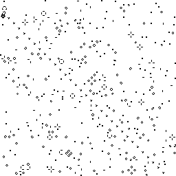
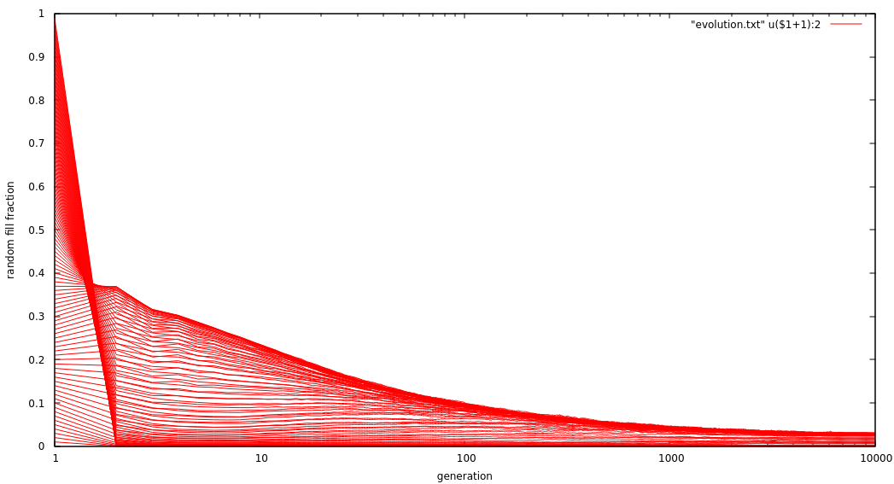

# Game of life, high performance
 

Accelerated implementation of Conway's game of life. Large boards (>1M cells) process at about 2 billion cells per second (!) on a single core of my i7-3612QM CPU @ 2.10GHz.
That's about one clock cycle per cell.

## Universe representation

We pack 16 cell states in a single 64-bit integer, using 4 bits of storage per cell. Dead cell: `0000`, live cell: `0001`. Using 4 bits per cell gives us just enough headroom to do all computations on entire words at once. E.g.: 3x16 cells are stored in these 3 64-bit words:

|    |    |    |    |    |    |    |    |
|----|----|----|----|----|----|----|----|
|0000|0001|0000|0000|0000|0001|0000|0001|
|0000|0001|0001|0000|0000|0001|0001|0001|
|0000|0000|0001|0000|0000|0000|0001|0001|

## Counting neighbors

By using 4 bits per cell, we can count neighbors without unpacking. We calculate the neighbors for one entire row of cells at a time. First we, make a partial sum adding up the row, the row above and the row below. E.g.: for the center row:

|    |    |    |    |    |    |    |    |
|----|----|----|----|----|----|----|----|
|0000|0001|0000|0000|0000|0001|0000|0001|
|0000|0001|0001|0000|0000|0001|0001|0001|
|0000|0000|0001|0000|0000|0000|0001|0001|

`+ =`

|0000|0010|0010|0000|0000|0010|0010|0011|
|----|----|----|----|----|----|----|----|
|    |    |    |    |    |    |    |    |

This requires only 2 64-bit additions.

Second, for each nibble in this partial sum, we need to add its left and right neighbor. We do this by adding the row with itself shifted by 4 bits to the left and 4 bits to the right.

|    |    |    |    |    |    |    |    |    |    |
|----|----|----|----|----|----|----|----|----|----|
|0000|0010|0010|0000|0000|0010|0010|0011|<<<<|    |
|    |0000|0010|0010|0000|0000|0010|0010|0011|    |
|    |>>>>|0000|0010|0010|0000|0000|0010|0010|0011|
| += |----|----|----|----|----|----|----|----|----|
|    |*0000*|0010|0100|0100|0010|0010|0100|0111|    |

Of course, when shifting, we need to fill in the 4 bits on the left or right side with the corresponding bits of the neighboring word. We marked those with `<<<<` for brevity.

We now have the number of neighbors for 16 cells, using only a few additions and shifts. A more straightforward implementation might have taken about 100 1-byte loads, 100 additions and 100 stores.

Note that we include the central cell itself in the number of neighbors. We'll take that into account later.

## Finding the next state

The liveness of a cell and its number of neighbors determine the cell's next state. We do this with a look-up table mapping the cell state and number of neighbors to the cell's next state.

That would be 5-bit lookup key, which is unfortunate. However, we can use a tick here: the look-up key is the bitwise OR of the number of neighbors with the cell state << 3. This operation looses information, as the high bit of the number of neighbors gets overwritten by the cell state. Fortunately this does not matter for the final result! A cell with 8 or 9 neighbors will be dead regardless of its initial state.

|cell|neighbors|look-up key|next state|
|----|---------|-----------|----------|
|0000|     0000|       0000|      0000|
|0000|     0001|       0001|      0000|
|0000|     0010|       0010|      0000|
|0000|     0011|       0011|      0001|
| ...|      ...|        ...|       ...|
|0000|     1010|       1010|      0000|
| ...|      ...|        ...|       ...|
|0001|     0000|       1000|      0000|
|0001|     0001|       1001|      0000|
|0001|     0010|       1010|      0000|
|0001|     0011|       1011|      0001|
| ...|      ...|        ...|       ...|
|0001|     1010|       1010|      0000|

We can this find the look-up keys for 16 cells as the bitwise OR of the number of neighbors with the liveness state << 3.

|    |    |    |    |    |    |    |    |
|----|----|----|----|----|----|----|----|
|0000|0010|0100|0100|0010|0010|0100|0111|
|0000|1000|1000|0000|0000|1000|1000|1000|

`OR =`

|    |    |    |    |    |    |    |    |
|----|----|----|----|----|----|----|----|
|0000|1010|1100|0100|0010|1010|1100|1111|

Now we have 16 look-up keys using just 2 arithmetic operations.

But we're not done yet. We're not going to unpack those keys to do the look-ups one by one! We'll do them 4 cells (16bits) at a time. Our expanded look-up table holds the next states for 4 cells at a time and uses 2^16 x 16 bit = 131kB of memory.

A bigger look-up table holding 8 next states per key would use 8GB, so we'll not go there.

Putting this all together, we execute only a few dozen instructions to find the next state of 16 cells, less than two instructions per cell on average. The result is blazing fast, processing about 2 billion cells per second on a single intel core.

## cmd/weblife
Command weblife shows life state in browser. E.g.:

## cmd/evolution
Investigate evolution from random start state. Starting form different fill fractions, most boards evolve towards about 2.5% filled:

